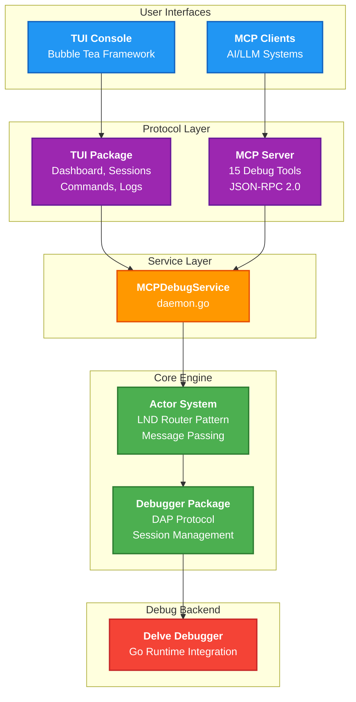

# MCP Debug Server

## Overview

The MCP Debug Server provides a bridge between the Debug Adapter Protocol (DAP) and the Model Context Protocol (MCP), enabling programmatic debugging of Go applications through a standardized interface. The system integrates Delve debugger capabilities with an actor-based architecture derived from the Lightning Network's concurrency patterns.

The project offers two primary interfaces: an interactive terminal user interface for human operators and a headless MCP server for integration with AI systems and other automated tools. Both interfaces share the same underlying debugging engine built on a service-oriented architecture with proper lifecycle management.

## Installation

Build the interactive TUI console:
```bash
go build -o tui-console ./cmd/tui
./tui-console
```

Build the headless MCP server:
```bash
go build -o dlv-mcp-server ./cmd/dlv-mcp-server
./dlv-mcp-server
```

### Claude Code Integration

To use this debugger with Claude Code, install the MCP server to your Go bin directory:

```bash
go install ./cmd/dlv-mcp-server
```

Then add it to Claude Code (assuming GOPATH/bin is in your PATH):

```bash
claude mcp add go-debugger dlv-mcp-server
```

If GOPATH/bin is not in your PATH, use the full path:
```bash
claude mcp add go-debugger $(go env GOPATH)/bin/dlv-mcp-server
```

Once added, Claude will have access to all 15 debugging tools provided by the MCP server. You can verify the connection by asking Claude to list available MCP tools or by starting a debug session.

### Gemini CLI Integration

To use this debugger with the Gemini CLI, first install the MCP server to your Go bin directory:

```bash
go install ./cmd/dlv-mcp-server
```

Then, add it to the Gemini CLI as an MCP server (assuming `GOPATH/bin` is in your `PATH`):

```bash
gemini mcp add go-debugger dlv-mcp-server
```

If `GOPATH/bin` is not in your `PATH`, use the full path:

```bash
gemini mcp add go-debugger $(go env GOPATH)/bin/dlv-mcp-server
```

Once added, Gemini will have access to all 15 debugging tools provided by the MCP server. You can verify the connection by asking Gemini to list available tools (`gemini tool list`) or by starting a debug session.

#### Manual MCP Server Configuration

For older versions of the Gemini CLI that do not include the `gemini mcp add` command, you can manually configure the MCP server by editing the `settings.json` file. This file is typically located at `~/.gemini/settings.json`.

You need to add an `mcpServers` object to this file. This object contains a key-value pair for each server, where the key is a unique name for the server and the value is an object defining how to launch and interact with it.

Here is an example of how to configure an MCP server in `settings.json`:

```json
{
  "mcpServers": {
    "go-debugger": {
      "command": "dlv-mcp-server",
      "env": [],
      "trust": true
    }
  }
}
```

#### Configuration Options

*   **`command`**: The command to execute to start the MCP server.
*   **`args`**: An array of string arguments to pass to the command.
*   **`cwd`**: The working directory in which to start the server.
*   **`env`**: Environment variables to set for the server process.
*   **`timeout`**: A timeout in milliseconds for requests to the server.
*   **`trust`**: A boolean to bypass tool call confirmations for that server.

**Note:** It is recommended to use the `gemini mcp add` command on newer versions of the Gemini CLI to avoid manual configuration errors.

## Architecture

The system is organized into focused packages with clear separation of concerns. At the root level, `daemon.go` provides the MCPDebugService which manages the lifecycle of all components. This service initializes the actor system, creates the MCP server, and ensures proper cleanup on shutdown.



The debugger package contains the core DAP protocol implementation and Delve integration. It uses an actor-based message passing system where debug commands are processed asynchronously through typed message interfaces. Each debugging session runs as an independent actor, allowing multiple concurrent debugging sessions with isolated state.

The MCP package exposes debugging capabilities as fifteen standardized tools accessible via JSON-RPC 2.0. These tools cover session management, program control, breakpoint management, execution control, and inspection capabilities. All tool arguments use strongly-typed structures with comprehensive validation.

The TUI package implements an interactive terminal interface using the Bubble Tea framework. It provides five distinct views: a dashboard showing real-time metrics, a sessions table for managing active debug sessions, a clients view for monitoring connections, a commands interface for executing MCP tools, and a logs viewer for system output. The TUI connects to the debugging engine through the same actor system used by the MCP server, ensuring consistency across interfaces.

## Package Structure

The project follows a hierarchical package structure where each package has a single, well-defined responsibility. The root package provides the service layer and lifecycle management. The debugger package handles all DAP protocol concerns and Delve integration. The MCP package translates debugging operations into MCP tools. The TUI package provides interactive monitoring and control.

Supporting packages include cmd for the production binaries, internal/test for development utilities, examples for demonstration programs, and agent_planning for comprehensive documentation of the implementation process.

## Actor System

The project uses the Lightning Network's actor system for concurrent message processing. This provides several key benefits over traditional mutex-based concurrency. Actors process messages sequentially, eliminating race conditions within actor boundaries. The router pattern enables load balancing across multiple debugger instances. Type-safe message interfaces ensure compile-time correctness of inter-actor communication.

Communication between actors follows two patterns. The Tell pattern provides fire-and-forget messaging for notifications and state updates. The Ask pattern implements request-response communication with futures for synchronous-style programming over asynchronous operations.

## MCP Tools

The MCP server exposes debugging functionality through fifteen tools:

Session management tools include `create_debug_session` for initializing new sessions and `initialize_session` for configuring DAP client capabilities.

Program control tools provide `launch_program` to start Go programs with debugging enabled, `attach_to_process` for debugging already-running processes, and `configuration_done` to signal readiness.

Breakpoint management is handled through `set_breakpoints` which accepts file paths and line numbers.

Execution control tools include `continue_execution`, `step_next`, `step_in`, `step_out`, and `pause_execution` for fine-grained control over program flow.

Inspection tools provide `get_threads` for thread information, `get_stack_frames` for call stacks, `get_variables` for scope inspection, and `evaluate_expression` for runtime evaluation.

## Terminal User Interface

The TUI provides comprehensive monitoring and control capabilities through a tabbed interface. Navigation uses standard keyboard shortcuts with Tab to switch views, arrow keys for selection, Enter to execute commands, and q or Ctrl+C to exit.

The dashboard view displays server status, active sessions, connected clients, total requests, error counts, and uptime. These metrics update in real-time as the server processes requests.

The sessions view presents a sortable table of all debugging sessions with columns for session ID, client information, program path, current status, and breakpoint counts. Sessions can be selected for detailed inspection.

The commands view provides an interactive prompt for executing MCP tools. Commands are entered as JSON objects specifying the tool name and arguments. A history of previously executed commands is maintained for reference and re-execution.

The logs view displays system output in a scrollable viewport with automatic following of new entries. Log entries are categorized by level and timestamped for debugging and audit purposes.

## Usage

For interactive debugging, start the TUI console and use the commands tab to create debugging sessions. For example, entering `{"tool": "create_debug_session", "args": {"session_id": "debug1"}}` initializes a new session. The session then appears in the sessions tab where its status can be monitored.

For programmatic access, run the MCP server and connect via the MCP protocol. The server accepts JSON-RPC 2.0 requests over standard I/O. Requests follow the MCP specification with tool invocations wrapped in the standard protocol envelope.

## Logging

The MCP Debug Server maintains detailed logs for debugging and troubleshooting purposes. Logs are automatically written to the `~/.dlv-mcp-server` directory in your home folder.

### Log File Structure

- **Location**: `~/.dlv-mcp-server/`
- **Format**: `debug_YYYY-MM-DD_HH-MM-SS.log` (timestamped for each server session)
- **Latest Log**: A symbolic link `latest.log` always points to the current session's log file

### Log Contents

Log files include:
- Server startup and initialization messages
- DAP protocol requests and responses
- Session lifecycle events (creation, initialization, termination)
- Debugging operations (breakpoints, stepping, evaluation)
- Error messages and stack traces when operations fail

### Viewing Logs

To view the current session's log in real-time:
```bash
tail -f ~/.dlv-mcp-server/latest.log
```

To search for specific operations or errors:
```bash
grep -i error ~/.dlv-mcp-server/latest.log
grep "evaluate" ~/.dlv-mcp-server/latest.log
```

### Log Retention

Log files are not automatically cleaned up. To manage disk space, periodically remove old log files:
```bash
# Remove logs older than 7 days
find ~/.dlv-mcp-server -name "debug_*.log" -mtime +7 -delete
```

## Development

The project follows the Lightning Network development guidelines for code style and commit conventions. Code uses an 80-character line limit with tabs for indentation. Functions are documented with godoc-compatible comments. Commits are prefixed with the affected package name.

Testing uses the standard Go testing framework with testify for assertions. Each package includes comprehensive unit tests. Integration tests verify the complete debugging workflow from MCP request through DAP protocol to Delve backend.

## Dependencies

The project relies on several key external libraries. The Lightning Network's actor system provides the concurrency framework. Google's go-dap implements the Debug Adapter Protocol. Charm's Bubble Tea powers the terminal interface. Mark3Labs' mcp-go handles MCP protocol concerns.

## Documentation

Comprehensive documentation is available in the agent_planning directory. This includes architectural decisions, implementation notes, and development history. Key documents cover the actor system patterns, TUI design and implementation, package restructuring process, and process attachment capabilities.

## License

This project is open source software. Consult the LICENSE file for terms and conditions.
